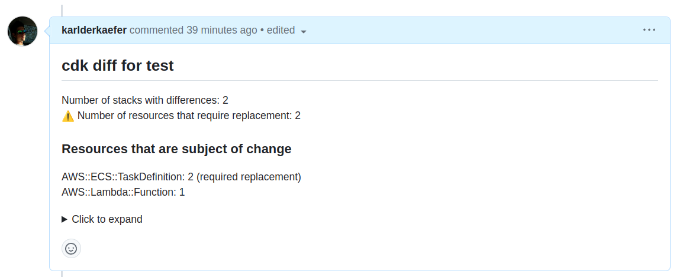

# cdk-notifier
<!-- ALL-CONTRIBUTORS-BADGE:START - Do not remove or modify this section -->
[](#contributors-)
<!-- ALL-CONTRIBUTORS-BADGE:END -->

[](https://circleci.com/gh/circleci/circleci-docs)
[](https://codecov.io/gh/karlderkaefer/cdk-notifier)
[](https://goreportcard.com/report/github.com/karlderkaefer/cdk-notifier)

lightweight CLI tool to parse a CDK log file and post changes to pull request requests.
Can be used to get more confidence on approving pull requests because reviewer will be aware of changes done to your
environments.

[Medium Article](https://betterprogramming.pub/improve-your-pull-request-experience-for-aws-cdk-projects-1fd5adb08bb3)

## Install

Install binary with latest release

```bash
curl -L "https://github.com/karlderkaefer/cdk-notifier/releases/latest/download/cdk-notifier_$(uname)_amd64.gz" -o cdk-notifier.gz
gunzip cdk-notifier.gz && chmod +x cdk-notifier && rm -rf cdk-notifier.gz
sudo mv cdk-notifier /usr/local/bin/cdk-notifier
```

Check Version and help

```bash
cdk-notifier --version
# 1.0.1

cdk-notifier --help
                                                 
# Post CDK diff log to Pull Request

# Usage:
#   cdk-notifier [flags]

# Flags:
#       --ci string                CI System used [circleci|bitbucket|gitlab] (default "circleci")
#       --custom-template string   File path or string input to custom template. When set it will override the template flag.
#   -d, --delete                   delete comments when no changes are detected for a specific tag id (default true)
#       --disable-collapse         Collapsible comments are enabled by default for GitHub and GitLab. When set to true it will not use collapsed sections.
#       --github-host string       Optional set host for GitHub Enterprise
#       --gitlab-url string        Optional set gitlab url (default "https://gitlab.com/")
#   -h, --help                     help for cdk-notifier
#   -l, --log-file string          path to cdk log file
#       --no-post-mode             Optional do not post comment to VCS, instead write additional file and print diff to stdout
#   -o, --owner string             Name of owner. If not set will lookup for env var [REPO_OWNER|CIRCLE_PROJECT_USERNAME|BITBUCKET_REPO_OWNER]
#   -p, --pull-request-id string   Id or URL of pull request. If not set will lookup for env var [PR_ID|CIRCLE_PULL_REQUEST|BITBUCKET_PR_ID|CI_MERGE_REQUEST_IID]
#   -r, --repo string              Name of repository without organisation. If not set will lookup for env var [REPO_NAME|CIRCLE_PROJECT_REPONAME|BITBUCKET_REPO_SLUG],'
#       --show-overview            [Deprected: use template extended instead] Show Overview are disabled by default. When set to true it will show the number of cdk stacks with diff and  the number of replaced resources in the overview section.
#   -t, --tag-id string            unique identifier for stack within pipeline (default "stack")
#       --template string          Template to use for comment [default|extended|extendedWithResources] (default "default")
#       --token string             Authentication token used to post comments to PR. If not set will lookup for env var [TOKEN_USER|GITHUB_TOKEN|BITBUCKET_TOKEN|GITLAB_TOKEN]
#   -u, --user string              Optional set username for token (required for bitbucket)
#       --vcs string               Version Control System [github|github-enterprise|bitbucket|gitlab] (default "github")
#   -v, --verbosity string         Log level (debug, info, warn, error, fatal, panic) (default "info")
#       --version                  version for cdk-notifier

```

### Using docker

The docker image is available on [dockerhub](https://hub.docker.com/r/karlderkaefer/cdk-notifier).

As alternative to passing arguments to cli you can create a env file with required variables, this is an example for github.

```bash
cat <<EOF > docker.env
REPO_OWNER=karlderkaefer
PR_ID=156
REPO_NAME=cdk-notifier
GITHUB_TOKEN=***
EOF
```

Then you can run the docker image with the env file.

```bash
docker run -v $(pwd)/data:/data --env-file docker.env karlderkaefer/cdk-notifier -l /data/cdk-diff1.log
$ time="2024-04-14T14:57:50Z" level=info msg="Created comment with id 2054088709 and tag id stack https://github.com/karlderkaefer/cdk-notifier/pull/156#issuecomment-2054088709"
```

## Usage

First create the output of cdk diff to file. You can stream cdk diff to stdout and to file with following.
This tool most like runs in a CI environment. To
avoid [printing millions of lines](https://github.com/aws/aws-cdk/issues/8893#issuecomment-654296389) you add progress
flag.

```bash
cdk diff --progress=events &> >(tee cdk.log)
```

cdk-notifier will then analyze and transform the log by

* remove ASCII colors
* prepare additions and deletion for GitHub markdown diff
* truncate log if
  exceeding [max length of body for comment](https://github.community/t/maximum-length-for-the-comment-body-in-issues-and-pr/148867/2)
  and then send

cdk-notifier will post the processed log of cdk diff to PR if there are changes.
If a diff comment for tag-id exists and no changes are detected then comment will delete.
You can control this behavior with `--delete=false`.

```bash
cdk-notifier --owner some-org --repo some-repo --token 1234 --log-file ./cdk.log --tag-id my-stack --pull-request-id 12 --vcs github --ci circleci
```

The `tag-id` has to be unique within one pipeline. It's been used to identify the comment to update or delete.

This is an example how the diff would like on github

```bash
cdk-notifier -l data/cdk-small.log -t test
```

Please note: GitLab, Bitbucket or Github tokens needs permission to write comments to PR.
As an example for GitHub PAT it requires `pull requests: read and write`.


### Github Enterprise

To use CDK-Notifier with Github Enterprise you need to set `--vcs github-enterprise` and `--github-host https://github.your-company.com`.

```bash
cdk-notifier -l data/cdk-diff1.log -t test --vcs github-enterprise --github-host https://github.your-company.com
```

In case you run a CircleCI Pipeline you can omit `--github-host`. It will detected from environment variable `CIRCLE_PULL_REQUEST` which follows the format `https://github.your-company.com/owner/repo/pull/1`

Thanks to [@mmogylenko](https://github.com/mmogylenko) for providing this feature.

### Bitbucket

To use cdk-notifier with Bitbucket you need to set `--vcs bitbucket` and `--user <username>`.
The username is required and is the name of the user who created the token.
Alternatively you can use the environment variable `TOKEN_USER`. This is an example with all options set.

```bash
cdk-notifier -l data/cdk-diff1.log -t test --vcs bitbucket --token <token> --owner <owner> --repo <repo> --pull-request-id <pr-id>
```

It's also possible to use [Workspace Access tokens](https://support.atlassian.com/bitbucket-cloud/docs/workspace-access-tokens/)
by just passing the `--token`.

## Support for CI Systems

CDK-Notifier is supporting following Version Control Systems

* github | github-enterprise
* bitbucket
* gitlab

If you run CDK-Notifier on CI Systems, you may not need to set flag for `owner`, `repo` or `pull-request-id`.
Those will be read in automatically if not set via cli args. See [priority mapping](#config-priority-mapping).
Following matrix is showing support for automatic mapping for different CI Systems.

| Version Control System | CirlceCi Support   | Bitbucket CI Support | Github CI Support | Gitlab CI Support  |
|------------------------|--------------------|----------------------|-------------------|--------------------|
| github                 | :heavy_check_mark: | :heavy_check_mark:   | :x:               | :x:                |
| bitbucket              | :heavy_check_mark: | :heavy_check_mark:   | :x:               | :x:                |
| gitlab                 | :x:                | :x:                  | :x:               | :heavy_check_mark: |

If you run cdk-notifier on CircleCi you don't need to set owner, repo or token.
CircleCi will provide default variables which will read in by cdk-notifier when cli arg is not set.

Example when running on CircleCi. See [available build variables](https://circleci.com/docs/env-vars#built-in-environment-variables)
```bash
CIRCLE_PR_NUMBER
CIRCLE_PROJECT_REPONAME
CIRCLE_PROJECT_USERNAME
```

Example when running on BitBucket CI. See [available build variables](https://support.atlassian.com/bitbucket-cloud/docs/variables-and-secrets/)
```bash
BITBUCKET_PR_ID
BITBUCKET_REPO_OWNER
BITBUCKET_REPO_SLUG
```

Example when running on Gitlab CI. See [available build variables](https://docs.gitlab.com/ee/ci/variables/predefined_variables.html)
```bash
CI_MERGE_REQUEST_IID
CI_PROJECT_NAMESPACE
CI_PROJECT_NAME
```

Token and usernames will be read in automatically despite on which CI they run. Potentially they override each other in order listed below.

```bash
TOKEN
GITHUB_TOKEN
BITBUCKET_TOKEN
GITLAB_TOKEN
```

### Custom Comment Template

You can choose the comment template by using the `--template` flag. Possible values are `default`, `extended` or `extendedWithResources`.

```bash
# show overview stats like number of resources replaced and number of changed stacks
cdk-notifier --template extendedWithResources
```



Optionally you can full customize the message by setting the flag `--custom-template` that points to a file with desired template.
You can use the [default template](./transform/template.go) as an reference. [Sprig](https://github.com/Masterminds/sprig) functions are supported in custom templates.
As alternative you can also set a multiline environment variable `CUSTOM_TEMPLATE`.

```bash
export CUSTOM_TEMPLATE="
{{ .HeaderPrefix }} {{ .TagID }} {{ .JobLink }}
my custom template
{{ .Backticks }}diff
{{ .Content }}
{{ .Backticks }}
"
```

## Config Priority Mapping
The config for CDK-Notifier is mapping in following priority (from low to high)
1. Environment Variables of Map Struct. For full list of Envs please check [code](https://github.com/karlderkaefer/cdk-notifier/blob/7e8b72d91096f7ee1c3fc1d97fb68ab84a129bc2/cmd/root.go#L109-L130)
    ```
    REPO_NAME
    REPO_OWNER
    TOKEN
    TOKEN_USER
    PR_ID
    LOG_FILE
    TAG_ID
    DELETE_COMMENT
    VERSION_CONTROL_SYSTEM
    CI_SYSTEM
    ```
2. CI System specific environment variable mapping. See [support-for-ci-systems](#support-for-ci-systems)
3. Default values for CLI args. See `cdk-notifier --help`
4. Values set by CLI e.g. `--token`

## No Post Mode

In case you only want to do the transformation into markdown diff, as described in [issue#46](https://github.com/karlderkaefer/cdk-notifier/issues/46).
```bash
./cdk-notifier -l data/cdk-diff1.log --tag-id small --no-post-mode
```
Any validation is skipped, you only need to set `--log-file` and `--tag-id`.
Enable this option `--no-post-mode` will write the markdown diff to stdout and a logfile.
The diff output file is using same path of cdk log file, but is appending `.diff` extension.

## Suppress Hash Changes

See github issue [issue#125](https://github.com/karlderkaefer/cdk-notifier/issues/125).
In case you want to suppress any hash changes in the diff, you can use the flag `--suppress-hash-changes`.
For example this would not post a diff for any changes in the hash of the resources [see example](./data/cdk-diff-resources-changes.log). You can override the regex that is used to detect hash changes with the flag `--suppress-hash-changes-regex` or setting the Environment Variable `SUPPRESS_HASH_CHANGES_REGEX`. This improvement was requested by [@wolverian](https://github.com/wolverian) in [issue#188](https://github.com/karlderkaefer/cdk-notifier/issues/188)

```bash
cdk-notifier -l data/cdk-suppress-regex.log --tag-id test --suppress-hash-changes --suppress-hash-changes-regex "^[+-].*?[a-fA-F0-9]{40}"
```

## Security
**Disclaimer**: Consider using on private repositories only.

The CDK log does not contain sensitive information by default. However, someone can argue the account id is considered as sensitive information.
CDK-Notifier does also not benefit from the automatic obscuring you may see in CI logs when using secret environment variables. 

## Versioning

Use [Conventional Commit Messages](https://www.conventionalcommits.org/en/v1.0.0/).
[Semantic Release](https://github.com/semantic-release/semantic-release) will release a new version with changelog.

examples:

``` 
# increase patch version
fix: fixing tests

# incease minor version
feat: add configuration

# increase major version:
feat: remove comments api

BREAKING CHANGE: remove comments api

# update docu
docs: update readme
```


## Contributors ✨

Thanks goes to these wonderful people ([emoji key](https://allcontributors.org/docs/en/emoji-key)):

<!-- ALL-CONTRIBUTORS-LIST:START - Do not remove or modify this section -->
<!-- prettier-ignore-start -->
<!-- markdownlint-disable -->
<table>
  <tbody>
    <tr>
      <td align="center" valign="top" width="14.28%"><a href="https://shawn.vause.us"><br /><sub><b>Shawn Vause</b></sub></a><br /><a href="https://github.com/karlderkaefer/cdk-notifier/commits?author=napalm684" title="Code">💻</a></td>
      <td align="center" valign="top" width="14.28%"><a href="https://maroto.me"><br /><sub><b>Jorge Maroto</b></sub></a><br /><a href="https://github.com/karlderkaefer/cdk-notifier/commits?author=patoroco" title="Documentation">📖</a></td>
      <td align="center" valign="top" width="14.28%"><a href="https://github.com/mmogylenko"><br /><sub><b>Mykola Mogylenko</b></sub></a><br /><a href="https://github.com/karlderkaefer/cdk-notifier/commits?author=mmogylenko" title="Code">💻</a></td>
      <td align="center" valign="top" width="14.28%"><a href="https://github.com/peter-svensson"><br /><sub><b>Peter Svensson</b></sub></a><br /><a href="https://github.com/karlderkaefer/cdk-notifier/commits?author=peter-svensson" title="Code">💻</a></td>
      <td align="center" valign="top" width="14.28%"><a href="https://johanneskonings.dev/"><br /><sub><b>Johannes Konings</b></sub></a><br /><a href="https://github.com/karlderkaefer/cdk-notifier/commits?author=JohannesKonings" title="Code">💻</a></td>
      <td align="center" valign="top" width="14.28%"><a href="https://github.com/joshmyers"><br /><sub><b>Josh Myers</b></sub></a><br /><a href="https://github.com/karlderkaefer/cdk-notifier/commits?author=joshmyers" title="Code">💻</a></td>
    </tr>
  </tbody>
</table>

<!-- markdownlint-restore -->
<!-- prettier-ignore-end -->

<!-- ALL-CONTRIBUTORS-LIST:END -->

This project follows the [all-contributors](https://github.com/all-contributors/all-contributors) specification. Contributions of any kind welcome!
