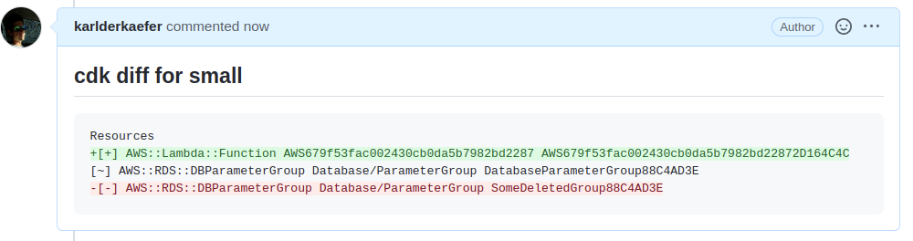

# cdk-notifier
[](https://circleci.com/gh/circleci/circleci-docs)
[](https://codecov.io/gh/napalm684/cdk-notifier)
[](https://goreportcard.com/report/github.com/napalm684/cdk-notifier)

lightweight CLI tool to parse a CDK log file and post changes to merge request requests.
Can be used to get more confidence on approving merge requests because reviewer will be aware of changes done to your environments.

## Motivation
This is a quick and "dirty" port of the awesome work done by [karlderkaefer](https://github.com/karlderkaefer) [here](https://github.com/karlderkaefer/cdk-notifier) to allow the
tool to work with Gitlab. I had an immediate need for the functionality and am only maintaining this fork until the work can be ported to the original
repository. At that time this repository will be archived.

## Install

Install binary with latest release
```bash
curl -L "https://github.com/napalm684/cdk-notifier/releases/latest/download/cdk-notifier_$(uname)_amd64.gz" -o cdk-notifier.gz
gunzip cdk-notifier.gz && chmod +x cdk-notifier && rm -rf cdk-notifier.gz
sudo mv cdk-notifier /usr/local/bin/cdk-notifier
```
Check Version and help
```bash
cdk-notifier --version
# 1.0.1

cdk-notifier --help
#Post CDK diff log to Gitlab Merge Request
#
#Usage:
#  cdk-notifier [flags]
#
#Flags:
#  -d, --delete                delete comments when no changes are detected for a specific tag id (default true)
#  -u, --url string            Gitlab url (default "https://gitlab.com"). If not set will lookup for env var GITLAB_BASE_URL
#      --gitlab-token string   Gitlab token used to post comments to MR. If not set will lookup for env var GITLAB_TOKEN
#  -p  --gitlab-pid int        Gitlab project ID for merge request. If not set will lookup for env var CI_MERGE_REQUEST_PROJECT_ID
#  -h, --help                  help for cdk-notifier
#  -l, --log-file string       path to cdk log file (default "./cdk.log")
#  -m, --merge-request-id int  Id of gitlab merge request. If not set will lookup for env var CI_MERGE_REQUEST_IID
#  -t, --tag-id string         unique identifier for stack within pipeline (default "stack")
#  -v, --verbosity string      Log level (debug, info, warn, error, fatal, panic) (default "info")
#      --version               version for cdk-notifier
```

## Usage
First create the output of cdk diff to file. You can stream cdk diff to stdout and to file with following.
This tool most likely runs in a CI environment. To avoid [printing millions of lines](https://github.com/aws/aws-cdk/issues/8893#issuecomment-654296389) you add progress flag.
```bash
cdk diff --progress=events &> >(tee cdk.log)
```
cdk-notifier will then analyze and transform the log by
* remove ASCII colors
* prepare additions and deletion for GitLab markdown diff
* truncate log if exceeding [max length of body for MR note](https://docs.gitlab.com/ee/api/notes.html#create-new-merge-request-note)
and then send
  
cdk-notifier will post the processed log of cdk diff to MR if there are changes.
If a diff comment for tag-id exists and no changes are detected then comment will delete. 
You can control this behavior with `--delete false`.

```bash
cdk-notfier --url gitlab-url --gitlab-token 1234 --log-file ./cdk.log --tag-id my-stack --merge-request-id 12 --gitlab-pid 1
```
The `tag-id` has to be unique within one pipeline. It's been used to identify the comment to update or delete.

This is an example how the diff would like on gitlab 
```bash
cdk-notifier -l data/cdk-small.log -t small
```


## Versioning
Use [Conventional Commit Messages](https://www.conventionalcommits.org/en/v1.0.0/).
[Semantic Release](https://github.com/semantic-release/semantic-release) will release a new version with changelog.

examples:
``` 
# increase patch version
fix: fixing tests

# incease minor version
feat: add configuration

# increase major version:
feat: remove comments api

BREAKING CHANGE: remove comments api

# update docu
docs: update readme
```
